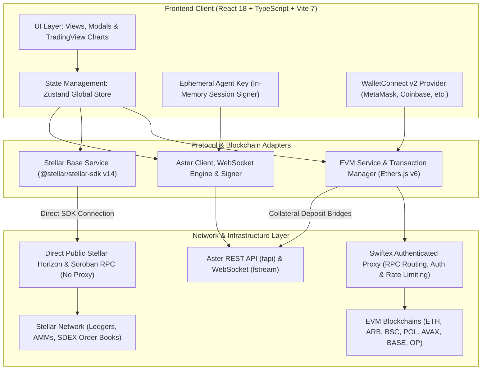
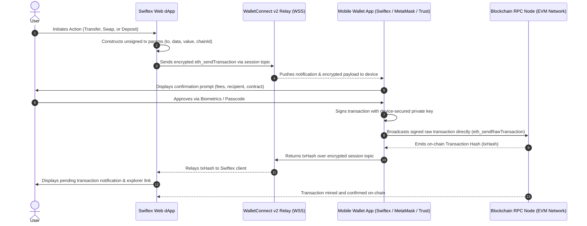

# Swiftex Wallet Exchange

**Institutional-Grade Non-Custodial Multi-Chain DeFi Trading Platform & Perpetual Futures**

[](https://react.dev/)
[](https://www.typescriptlang.org/)
[](https://vitejs.dev/)
[](https://tailwindcss.com/)
[](https://stellar.org/)
[](https://docs.ethers.org/v6/)
[](LICENSE)
[](https://swiftexchange.io)

[Live Web Platform](https://swiftexchange.io) • [iOS App Store](https://apps.apple.com/us/app/swiftex-wallet/id6759080930) • [Google Play](https://play.google.com/store/apps/details?id=org.app.swiftEx.wallet&pcampaignid=web_share) • [Discord](https://discord.com/invite/TkZrnv97MV)

---

## 📖 Table of Contents

- [Overview](#-overview)
- [Mobile Applications](#-mobile-applications)
- [Screenshots](#-screenshots)
- [Supported Networks & Ecosystems](#-supported-networks--ecosystems)
- [Perpetual Futures Trading (Aster DEX)](#-perpetual-futures-trading-aster-dex)
- [System Architecture](#-system-architecture)
  - [High-Level Architecture Diagram](#high-level-architecture-diagram)
  - [Aster Perpetual Trading Lifecycle](#aster-perpetual-trading-lifecycle)
  - [WalletConnect Transaction & Broadcast Flow](#walletconnect-transaction--broadcast-flow)
  - [Stellar Direct SDK Integration](#stellar-direct-sdk-integration)
- [Key Features](#-key-features)
- [User Journey](#-user-journey)
- [Technology Stack](#️-technology-stack)
- [Getting Started](#-getting-started)
- [Environment Configuration](#-environment-configuration)
- [Security & Risk Model](#-security--risk-model)
- [Project Directory Structure](#-project-directory-structure)
- [Roadmap](#-roadmap)
- [License](#-license)
- [Support & Community](#-support--community)

---

## 🌟 Overview

**Swiftex Wallet Exchange** is an open-source, non-custodial decentralized trading hub connecting the EVM ecosystem and the Stellar Network into a single, unified interface.

Swiftex gives traders complete sovereign control of their private keys while delivering a CEX-grade user experience: manage assets across 7+ major EVM chains and Stellar, execute cross-chain swaps, bridge assets, and trade perpetual derivatives on Aster DEX with zero repetitive wallet approval popups.

---

## 📱 Mobile Applications

Swiftex is available on both iOS and Android. Trade, swap, and manage assets directly from your mobile device:

- 🍏 **iOS (App Store)**: [Download on Apple App Store](https://apps.apple.com/us/app/swiftex-wallet/id6759080930)
- 🤖 **Android (Google Play)**: [Get it on Google Play](https://play.google.com/store/apps/details?id=org.app.swiftEx.wallet&pcampaignid=web_share)

---

## 📸 Screenshots

<p align="center">
  
  
</p>
<p align="center">
  
  
</p>

---

## 🌐 Supported Networks & Ecosystems

Swiftex natively connects to **7 EVM networks** alongside the **Stellar Network**, providing an expansive cross-chain asset universe:

| Network               | Chain ID / Type    | Native Gas Token | Supported Capabilities                            | Aster Perps Bridge | Explorer                                        |
| :-------------------- | :----------------- | :--------------- | :------------------------------------------------ | :----------------: | :---------------------------------------------- |
| **Ethereum**          | `1` (EVM Mainnet)  | ETH              | Balance, Transfer, Swaps, Cross-Chain Bridge      |       ✅ Yes       | [Etherscan](https://etherscan.io)               |
| **Arbitrum One**      | `42161` (EVM L2)   | ETH              | Balance, Transfer, Swaps, Cross-Chain Bridge      |       ✅ Yes       | [Arbiscan](https://arbiscan.io)                 |
| **BNB Smart Chain**   | `56` (EVM L1)      | BNB              | Balance, Transfer, Swaps, Cross-Chain Bridge      |       ✅ Yes       | [BscScan](https://bscscan.com)                  |
| **Polygon PoS**       | `137` (EVM L1/L2)  | POL              | Balance, Transfer, Swaps, Cross-Chain Bridge      |         —          | [PolygonScan](https://polygonscan.com)          |
| **Avalanche C-Chain** | `43114` (EVM L1)   | AVAX             | Balance, Transfer, Swaps, Cross-Chain Bridge      |         —          | [Snowtrace](https://snowtrace.io)               |
| **Base**              | `8453` (EVM L2)    | ETH              | Balance, Transfer, Swaps, Cross-Chain Bridge      |         —          | [BaseScan](https://basescan.org)                |
| **Optimism**          | `10` (EVM L2)      | ETH              | Balance, Transfer, Swaps, Cross-Chain Bridge      |         —          | [OP Etherscan](https://optimistic.etherscan.io) |
| **Stellar**           | `pubnet` (Non-EVM) | XLM              | AMM Swaps, Order Book Trading, Trustlines, Bridge |         —          | [StellarExpert](https://stellar.expert)         |

---

## 📈 Perpetual Futures Trading (Aster DEX)

> [!NOTE]  
> **Status: Under Active Development (Beta)**  
> Perpetual trading powered by the Aster DEX protocol is currently in active development. Features, market coverage, and execution flows are continuously expanded and refined.

### How Swiftex Integrates Aster DEX

Swiftex interacts with Aster's high-performance perpetual architecture (Chain ID `1666`) while preserving full non-custodial integrity:

1. **Ephemeral Agent Wallet (One-Click Trading)**:
   - Users sign a one-time cryptographic authorization (EIP-712 / personal_sign) using their primary EVM wallet.
   - An ephemeral **Agent Wallet session key** is generated in browser memory.
   - The agent key is authorized **strictly for order creation and cancellation** — it has **zero permission to transfer, withdraw, or siphon collateral**.
   - Traders execute orders instantly without annoying wallet popups for every single trade.
   - Session keys automatically wipe on tab closure and can be revoked on-chain at any moment.

2. **Cross-Chain Collateral Bridging**:
   - Collateral deposits route directly into official Aster vault bridge contracts on **Ethereum**, **BNB Smart Chain**, or **Arbitrum One**.
   - Collateral credits on-chain directly to the trader's Aster account.

3. **Institutional Order Execution**:
   - **Order Types**: `MARKET`, `LIMIT`, `STOP`, `STOP_MARKET`, `TAKE_PROFIT`, `TAKE_PROFIT_MARKET`, `CHASE`, and `BATCH_ORDERS`.
   - **Margin Modes**: Full support for both **Cross Margin** and **Isolated Margin**.
   - **Multi-Asset Margin Mode**: Leverage equity across multiple supported deposit assets.
   - **Dynamic Leverage**: Configurable leverage brackets tailored to market volatility.

4. **Low-Latency Streaming**:
   - Dedicated WebSocket connection (`wss://fstream.asterdex.com/ws`) streams live aggregated trades, real-time depth diffs, and 24hr tickers.
   - User data stream tracks open orders, position risk, liquidation warnings, and realized/unrealized P&L in real time.

---

## 🏗️ System Architecture

### High-Level Architecture Diagram



### Aster Perpetual Trading Lifecycle

```
[User Connects EVM Wallet]
            │
            ▼
[One-Time EIP-712 Sign: Authorize Agent Key]
   • Generates session trading key in browser memory
   • Granted trading-only scope (NO withdrawal rights)
            │
            ▼
[Deposit Collateral via EVM Bridge (ETH / BSC / ARB)]
   • Funds credited to user's Aster on-chain margin balance
            │
            ▼
[Configure Trade]
   • Select Margin: Cross Margin or Isolated Margin
   • Select Asset Mode: Single-Asset or Multi-Asset
   • Set Leverage & Order Type (Market / Limit / Stop / Chase)
            │
            ▼
[Instant Order Submission]
   • Signed locally by in-memory Agent Wallet (No wallet popup!)
   • Routed to Aster matching engine via REST (fapi)
            │
            ▼
[Real-Time Position Monitoring]
   • Aster WebSocket stream (fstream) feeds live P&L, depth, and fills
   • User can modify, chase, or close positions instantly
```

### WalletConnect Transaction & Broadcast Flow

The following diagram illustrates how EVM transactions (token transfers, cross-chain swaps, bridges, or collateral deposits) originate in the Swiftex web dApp, get securely signed on your mobile device, and get broadcast directly to the blockchain:



#### How the Transaction Lifecycle Works:

1. **Unsigned Payload Assembly**: Swiftex constructs the exact transaction parameters (`to`, `value`, `data`, `chainId`) in-browser without having access to or needing your private key.
2. **End-to-End Encrypted Relay**: The transaction request is serialized, encrypted using symmetric keys negotiated during pairing, and relayed securely over `wss://relay.walletconnect.com`.
3. **Hardware Enclave Signing**: Your mobile wallet app decrypts the request and prompts you with the full details (gas limits, contract method, amounts) for your explicit biometric/passcode approval.
4. **Direct Wallet-to-Chain Broadcast**: **The wallet app itself broadcasts the signed raw transaction directly to the blockchain RPC node** (`eth_sendRawTransaction`). Swiftex never intercepts or handles your private keys.
5. **Real-Time Receipt & Tracking**: The wallet returns the generated `txHash` back across the encrypted relay to Swiftex, which updates the UI and monitors the transaction until confirmation.

### Stellar Direct SDK Integration

> [!IMPORTANT]  
> **Stellar Horizon Architecture**:  
> Unlike EVM RPC calls which pass through the Swiftex authenticated proxy for security, caching, and rate limiting, **Stellar Horizon operations communicate directly via `@stellar/stellar-sdk`**.
>
> - Uses `StellarSDK.Horizon.Server(config.horizonUrl)` directly in the browser client.
> - Direct querying of account balances, trustlines, recent trades, and SDEX orderbooks.
> - Direct submission of Stellar transactions to official Horizon nodes (`horizon.stellar.org` and `horizon-testnet.stellar.org`).
> - Zero intermediary proxy latency for Stellar operations.

---

## 🎯 Key Features

### 💼 Multi-Chain Portfolio & Asset Management

- **Unified Multi-Chain Balances**: View all holdings across Ethereum, Arbitrum, Polygon, Avalanche, BNB Chain, Base, Optimism, and Stellar in a single dashboard.
- **WalletConnect v2 Standard**: Seamless pairing with 300+ mobile and browser extension wallets.
- **Native & ERC20 Transfers**: Simple, validated transfers across all supported EVM networks.

### 🔄 Decentralized Cross-Chain & Spot Exchange

- **Stellar AMM Swaps**: Execute swaps directly on Stellar's native automated market maker pools.
- **Decentralized Order Book (SDEX)**: Place and settle bids/asks on Stellar's native order books.
- **Trustline Management**: Create, view, and revoke Stellar asset trustlines with one click.
- **EVM ↔ Stellar Cross-Chain Bridge**: Move assets seamlessly across ecosystem boundaries.

### 📈 Perpetual Derivatives (Aster DEX)

- **Comprehensive Order Suite**: Market, Limit, Stop-Loss, Take-Profit, Chase, and Batch order execution.
- **Agent Wallet Speed**: Zero popup delays on order entry.
- **Advanced Order Controls**: Take-profit, stop-loss, post-only, reduce-only, and chase orders.
- **Multi-Asset Collateral**: Use multiple supported tokens as unified margin collateral.

### 📊 Professional Market Intelligence

- **TradingView Lightweight Charts**: High-speed, responsive price action rendering.
- **Real-Time Depth Visualization**: Live L2 order book updates over low-latency WebSockets.
- **Portfolio P&L Tracking**: Live calculation of margin ratios, maintenance margins, and unrealized profit/loss.

---

## 👤 User Journey

```
┌─────────────────┐       ┌─────────────────┐       ┌─────────────────┐
│ 1. Connect      │  ──►  │ 2. Unified View │  ──►  │ 3. Trade & Swap │
│ Any EVM/Stellar │       │ Aggregate Assets│       │ Spot, Bridge or │
│ Wallet          │       │ Across 8 Chains │       │ Aster Perps     │
└─────────────────┘       └─────────────────┘       └─────────────────┘
```

1. **Connect Wallet**: Click "Connect Wallet" and choose MetaMask, Coinbase Wallet, Trust Wallet, or Stellar wallets (Freighter, Lobstr, xBull).
2. **View Cross-Chain Assets**: Your balances across Ethereum, Arbitrum, Polygon, Avalanche, BNB Chain, Base, Optimism, and Stellar sync in real time.
3. **Choose an Action**:
   - **Spot Swap / Transfer**: Transact natively on any supported EVM chain or Stellar.
   - **Bridge**: Transfer assets across EVM and Stellar networks.
   - **Perps Trading**: Approve your Agent Wallet once, deposit margin, and begin leveraged futures trading with zero popup friction.

---

## 🛠️ Technology Stack

### Core Frontend

- **Framework**: [React 18.3](https://react.dev/)
- **Build Tool**: [Vite 7.1](https://vitejs.dev/)
- **Language**: [TypeScript 5.8](https://www.typescriptlang.org/)
- **Styling**: [Tailwind CSS 4.2](https://tailwindcss.com/) with `@tailwindcss/vite`
- **Routing**: [React Router DOM v7](https://reactrouter.com/)

### Blockchain & Protocols

- **EVM Interaction**: [Ethers.js v6.15](https://docs.ethers.org/v6/)
- **Stellar Network**: [@stellar/stellar-sdk v14.4](https://stellar.org/) (Direct Horizon SDK integration)
- **Multi-Wallet Protocol**: [@walletconnect/universal-provider v2.23](https://walletconnect.com/)
- **Perpetual Derivatives**: [Aster DEX REST & WebSocket APIs](https://www.asterdex.com/)

### State, Charts & Utilities

- **State Management**: [Zustand v5](https://github.com/pmndrs/zustand)
- **Financial Charting**: [TradingView Lightweight Charts v5](https://www.tradingview.com/lightweight-charts/)
- **Big Number Math**: [bignumber.js](https://mikemcl.github.io/bignumber.js/)
- **Icons**: [Lucide React](https://lucide.dev/)

---

## 🚀 Getting Started

### Prerequisites

- **Node.js**: `v20.0.0` or higher (Recommended: `v22+` for full test suite compatibility)
- **npm**: `v10.0.0` or higher
- **Web3 Wallet**: MetaMask, Coinbase Wallet, Rabby, OKX, Rainbow, or Stellar Freighter

### Installation

1. **Clone the repository:**

   ```bash
   git clone https://github.com/SwiftExWallet/swiftexchange-web.git
   cd swiftexchange-web
   ```

2. **Install dependencies:**

   ```bash
   npm install
   ```

3. **Configure Environment Variables:**

   ```bash
   cp .env.example .env
   ```

   Fill in your WalletConnect Project ID and API credentials (see details below).

4. **Run Local Development Server:**
   ```bash
   npm run dev
   ```
   Open your browser at [http://localhost:5173](http://localhost:5173).

### Available Scripts

| Command                 | Action                                                                               |
| :---------------------- | :----------------------------------------------------------------------------------- |
| `npm run dev`           | Launch local Vite development server with hot module replacement                     |
| `npm run build`         | Build optimized production bundle with memory allocation (`max-old-space-size=4096`) |
| `npm run preview`       | Locally preview production build                                                     |
| `npm run lint`          | Run ESLint across code files                                                         |
| `npm run lint:fix`      | Automatically fix ESLint errors                                                      |
| `npm run format`        | Format codebase using Prettier                                                       |
| `npm run test`          | Run Vitest unit & integration test suite                                             |
| `npm run test:ui`       | Run Vitest with visual browser UI                                                    |
| `npm run test:coverage` | Generate test coverage report                                                        |

---

## ⚙️ Environment Configuration

Create a `.env` file in the root directory with the following configuration:

```env
# ==========================================
# WalletConnect Configuration
# ==========================================
# Get your Project ID at: https://cloud.walletconnect.com/
VITE_WALLETCONNECT_PROJECT_ID=your_walletconnect_project_id
VITE_WALLETCONNECT_RELAY_URL=wss://relay.walletconnect.com

# ==========================================
# Development Environment (Proxy & Server)
# Note: Stellar Horizon calls bypass proxy and connect directly via Stellar SDK
# ==========================================
VITE_BASE_SERVER_URL_DEV=https://dev-api.swiftex.exchange
VITE_BASE_PROXY_URL_DEV=https://dev-proxy.swiftex.exchange
VITE_API_DEVICE_AUTH_DEV=your_dev_auth_token

# ==========================================
# Production Environment (Proxy & Server)
# ==========================================
VITE_BASE_SERVER_URL_PROD=https://api.swiftex.exchange
VITE_BASE_PROXY_URL_PROD=https://proxy.swiftex.exchange
VITE_API_DEVICE_AUTH_PROD=your_prod_auth_token
```

---

## 🔐 Security & Risk Model

### Non-Custodial Security Core

- **Client-Side Signatures Only**: Your private keys never leave your wallet software.
- **In-Memory Agent Wallet**: Ephemeral session keys for Aster trading exist only in browser memory and are permanently erased upon closing the session.
- **Strict Permission Boundaries**: Agent keys are cryptographically restricted to order placement and cancellation. They are mathematically incapable of executing withdrawals or balance transfers.
- **Direct Stellar Horizon Communication**: Stellar SDK connects directly to trusted Stellar Horizon servers without intermediate manipulation.

### Best Practices for Traders

- Always verify recipient addresses and chain IDs before approving on-chain transactions.
- Review and revoke session authorizations when trading on shared or public computers.
- Never share your seed phrase or private keys with anyone. Swiftex team members will **never** ask for your credentials.

---

## 📂 Project Directory Structure

```
swiftex-walletexchange/
├── public/                         # Static public assets
├── src/
│   ├── abi/                        # EVM Smart contract ABIs
│   ├── components/                 # Global UI components (modals, navbar, buttons)
│   ├── constants/                  # System constants & network definitions
│   ├── data/                       # Static reference datasets
│   ├── modules/                    # Feature modules
│   │   ├── alchemyPay/             # Fiat on-ramp integration
│   │   ├── commonfeature/          # Cross-module shared components
│   │   ├── evm/                    # EVM chains implementation
│   │   │   ├── components/         # EVM UI components
│   │   │   ├── feature/            # EVM business logic (swap, bridge, transfer)
│   │   │   ├── hook/               # Custom EVM React hooks
│   │   │   ├── service/            # Ethers providers and transaction management
│   │   │   └── utils/              # Multi-chain registry (ETH, ARB, POL, AVAX, BSC, BASE, OP)
│   │   ├── market/                 # Market feed & ticker logic
│   │   ├── perps/                  # Aster Perpetual Trading Module (Beta)
│   │   │   ├── adapters/aster/     # Aster API, WebSocket, signers, order engines
│   │   │   ├── components/         # Order books, charts, position tables, margin modals
│   │   │   ├── context/            # Perps trading state context
│   │   │   └── hooks/              # Trade calculation & balance sync hooks
│   │   ├── stellar/                # Stellar chain module (Direct Horizon SDK)
│   │   │   ├── components/         # SDEX orderbook, AMM swap interfaces
│   │   │   ├── hook/               # Stellar balance and trade hooks
│   │   │   └── service/            # Direct StellarSDK.Horizon server interactions
│   │   ├── transaction/            # Transaction history & tracker
│   │   └── walletconnect/          # WalletConnect v2 integration & Agent Key manager
│   ├── pages/                      # Application route views (Swap, Trade, Perps, Assets)
│   ├── routes/                     # Router hierarchy
│   ├── service/                    # Base API service & authenticated proxy client
│   ├── store/                      # Zustand state slices
│   ├── test/                       # Unit and integration test suites
│   ├── types/                      # Global TypeScript definitions
│   ├── utils/                      # Helper utilities
│   ├── App.tsx                     # Main layout & provider wrapper
│   ├── index.css                   # Global Tailwind styles
│   └── main.tsx                    # React application entry point
├── LICENSE                         # Apache License, Version 2.0
├── package.json                    # Project configuration & dependencies
├── tsconfig.json                   # TypeScript compiler configuration
└── vite.config.ts                  # Vite bundler configuration
```

---

## 🗺️ Roadmap

- [x] Multi-chain EVM wallet integration via WalletConnect v2 (ETH, ARB, BSC, POL, AVAX, BASE, OP)
- [x] Stellar native asset management, AMM Swaps, and SDEX order books
- [x] Direct Stellar SDK integration bypassing proxy
- [x] Native Mobile Applications live on iOS (App Store) & Android (Google Play)
- [x] Aster Perpetual Trading integration with Ephemeral Agent Wallets
- [x] Cross-margin and isolated-margin trading modes
- [x] Real-time L2 order books and depth feeds over WebSocket
- [ ] Multi-Asset collateral expansion for Aster Perps (In Development)

---

## 📄 License

This project is licensed under the **Apache License 2.0** - see the [LICENSE](LICENSE) file for details.

---

## 🆘 Support & Community

Join our growing community of traders and developers:

- **Official Website**: [swiftexchange.io](https://swiftexchange.io)
- **Twitter / X**: [@SwiftEx_Wallet](https://twitter.com/SwiftEx_Wallet)
- **Instagram**: [@swiftexwallet](https://instagram.com/swiftexwallet)
- **Discord Community**: [Join Discord](https://discord.com/invite/TkZrnv97MV)
- **LinkedIn**: [Swiftex Wallet](https://www.linkedin.com/authwall?trk=bf&trkIn)
- **GitHub Issues**: [Report an Issue / Suggest a Feature](https://github.com/SwiftExWallet/swiftexchange-web/issues)

---

<p align="center">
  Built with ❤️ by the <b>Swiftex Team</b> • Empowering sovereign decentralized finance
</p>
